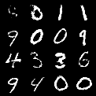

# GAN Image Generation using PyTorch

## Overview
This project implements a Generative Adversarial Network (GAN) using PyTorch to generate handwritten digit images from random noise using the MNIST dataset.

## Features
- Generates handwritten digit images
- Built with Generator and Discriminator neural networks
- Trained on the MNIST dataset
- Saves generated images automatically
- Implemented using PyTorch

## Technologies Used
- Python
- PyTorch
- Torchvision
- NumPy
- Matplotlib

## Project Structure
GAN-Image-Generation/
├── generator.py
├── discriminator.py
├── train.py
├── requirements.txt
├── generated_images/
└── README.md

## Output
The model generates synthetic handwritten digit images after training.

## Author
**Muthamma P M**

## Sample Output
